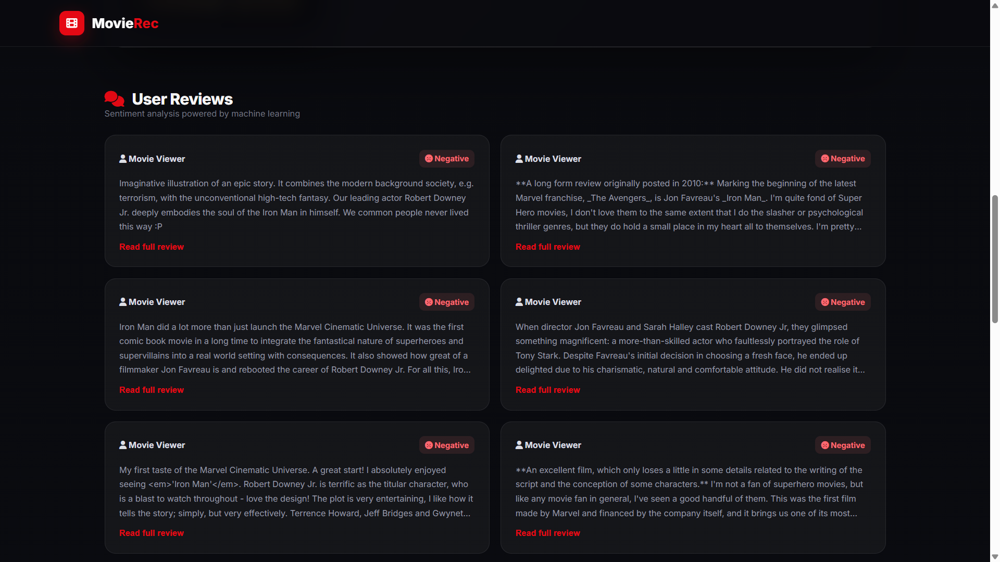
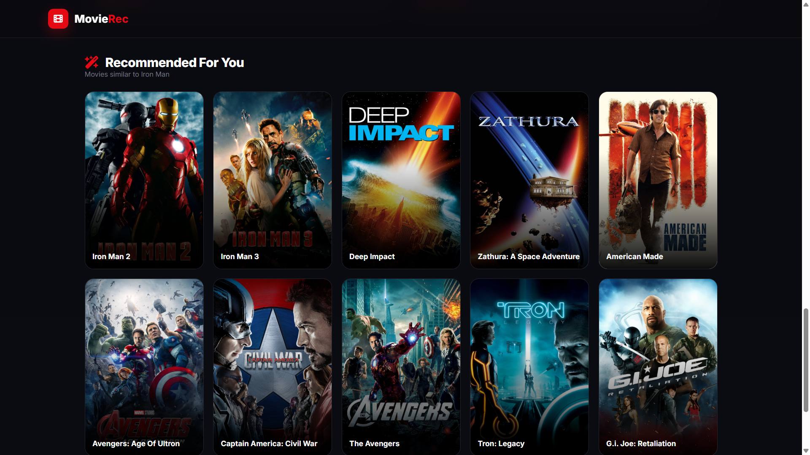
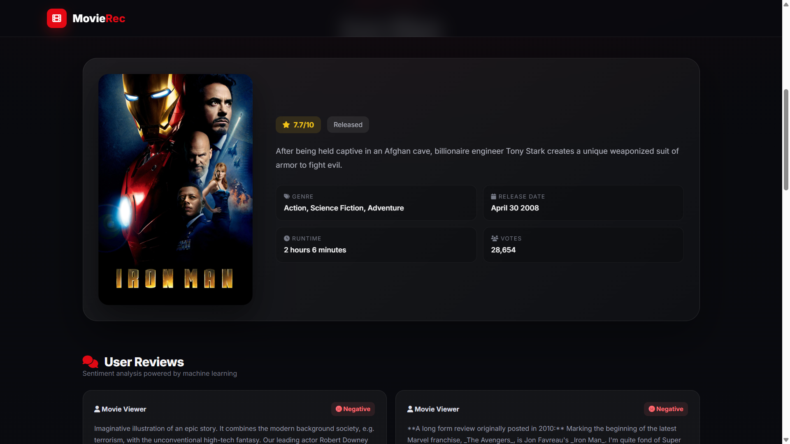

## Movie / Content Recommendation System

A hybrid recommendation system that suggests personalized movies using both **collaborative filtering (SVD)** and **content-based filtering (TF-IDF)**. The project works on a ratings dataset with **100k+ interactions** and tracks experiments using **MLflow** .

## 🚀 Features
- Hybrid recommender: **SVD (ratings) + TF-IDF (metadata)**
- Handles cold-start better than pure collaborative filtering
- Evaluated using **Precision@K, Recall@K, RMSE**
- Experiment tracking using **MLflow**
- Query-based recommendations possible

---

## Tech Stack
- **Python**
- **SQL**
- **Scikit-learn**
- **MLflow**
- Pandas, NumPy

---
## 📸 Screenshots

### Recommendation Results








## Approach
### 1) Collaborative Filtering
- Uses **SVD** factorization on user-item interaction matrix
- Learns user & item latent embeddings

### 2) Content-Based Filtering
- Movie metadata transformed using **TF-IDF**
- Similarity computed with cosine similarity

### 3) Hybrid Recommendation
Final recommendations combine:
- SVD predicted ratings
- Content similarity score

---

## Evaluation Metrics
- **Precision@K**
- **Recall@K**
- **RMSE**

---

## 📂 Repository Structure

```bash
Movie-Content-REcommendation-System/
│
├── data/                  # Dataset files
├── notebooks/             # Jupyter notebooks for experiments
├── src/                   # Source code
│   ├── preprocess.py      # Data preprocessing
│   ├── train_svd.py       # SVD model training
│   ├── content_model.py   # Content-based recommendation logic
│   ├── recommend.py       # Generate final recommendations
│   └── evaluate.py        # Evaluation metrics
│
├── mlruns/                # MLflow experiment tracking
├── requirements.txt       # Project dependencies
└── README.md              # Project documentation
```


---

## How to Run
### 1) Clone Repo
```bash
git clone https://github.com/<your-username>/<repo-name>.git
cd <repo-name>
2) Install Requirements
pip install -r requirements.txt
3) Run Recommendation
python src/recommend.py --user_id 5 --top_k 10
Track Experiments with MLflow
Start MLflow UI:

mlflow ui
Open:

http://127.0.0.1:5000
Example Output
Top 10 Recommendations:
1. The Dark Knight
2. Inception
3. Interstellar
...
